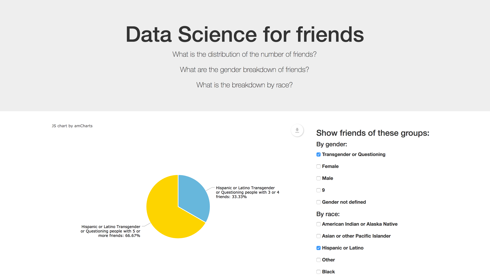
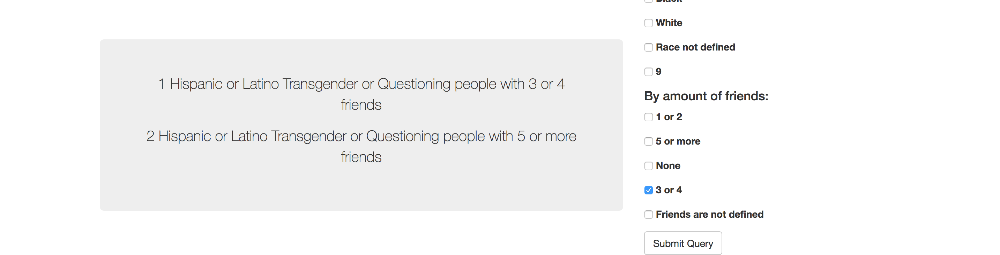

# outreachy-datascience
## School-YRBS: Friends. Issue 11 


## Task Instructions

The administration wants to better understand the social dynamic of the high school. The dataset contains a relevant column called friends, which is the number of friends of the student.

What is the distribution of the number of friends?
What are the gender breakdown of friends?
What is the breakdown by race?

## Proposed solution

Python script for dynamic data retrieval and monitoring. 








## Description

Given script generates a Flask web application for interactive data analysis. It dynamically parses data from given .csv file by:

1. Finding which columns do contain information regarding student's race, gender and amount of friends he has. 

2. Retrieving all types of races, genders and  amount of friends recorded from found columns.

3. Mapping race,  genders and  amount of friends relationships.

4. Providing neat interface for monitoring created relations.

## Downloading Software
Please, make sure you have installed Python 2.7 and Flask. For easy installation of Flask use:
```
pip install flask  
```

## Getting Started
Please, run script via following code:
```
python 11_madinab.py   
```

Then type this into your browser:
```
http://0.0.0.0:8000/
```
Demo:


## Answers

### What is the distribution of the number of friends?


1528 people with not defined friends

2360 people with 3 or 4 friends

412 people with None friends

2811 people with 5 or more friends

1760 people with 1 or 2 friends

### What are the gender breakdown of friends?


3 Transgender or Questioning people with 3 or 4 friends

755 Male people with not defined friends

7 Transgender or Questioning people with 5 or more friends

765 Female people with not defined friends

4 Transgender or Questioning people with 1 or 2 friends

1588 Male people with 5 or more friends

1076 Female people with 1 or 2 friends

673 Male people with 1 or 2 friends

970 Male people with 3 or 4 friends

219 Male people with None friends

1196 Female people with 5 or more friends

1362 Female people with 3 or 4 friends

189 Female people with None friends

### What is the breakdown by race?


517 Hispanic or Latino people with 1 or 2 friends

269 Hispanic or Latino people with not defined friends

15 American Indian or Alaska Native people with 5 or more friends

545 White people with 1 or 2 friends

363 Black people with 5 or more friends

45 Asian or other Pacific Islander people with None friends

121 Hispanic or Latino people with None friends

7 American Indian or Alaska Native people with None friends

211 Asian or other Pacific Islander people with 5 or more friends

176 Asian or other Pacific Islander people with 1 or 2 friends

72 White people with None friends

606 Hispanic or Latino people with 3 or 4 friends

7 American Indian or Alaska Native people with not defined friends

105 Black people with None friends

11 American Indian or Alaska Native people with 1 or 2 friends

252 Black people with not defined friends

126 Asian or other Pacific Islander people with not defined friends

207 Asian or other Pacific Islander people with 3 or 4 friends

1194 White people with 5 or more friends

911 White people with 3 or 4 friends

687 Hispanic or Latino people with 5 or more friends

282 Black people with 3 or 4 friends

14 American Indian or Alaska Native people with 3 or 4 friends

689 White people with not defined friends

272 Black people with 1 or 2 friends


Charts are exportable and can be downloaded. 


All credits for this amazing charts for [amcharts](https://www.amcharts.com/)


